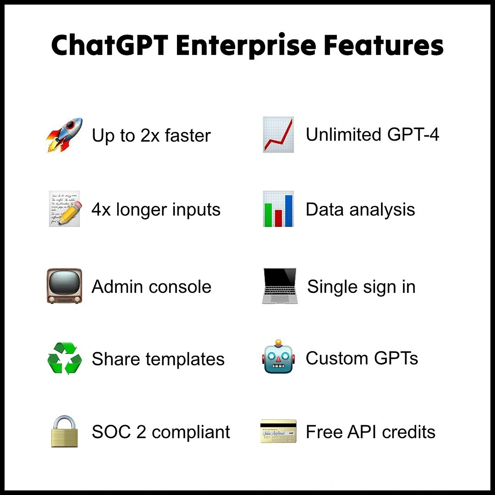
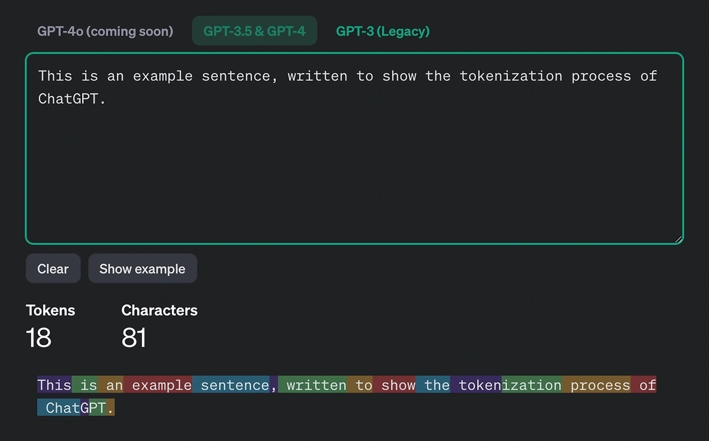
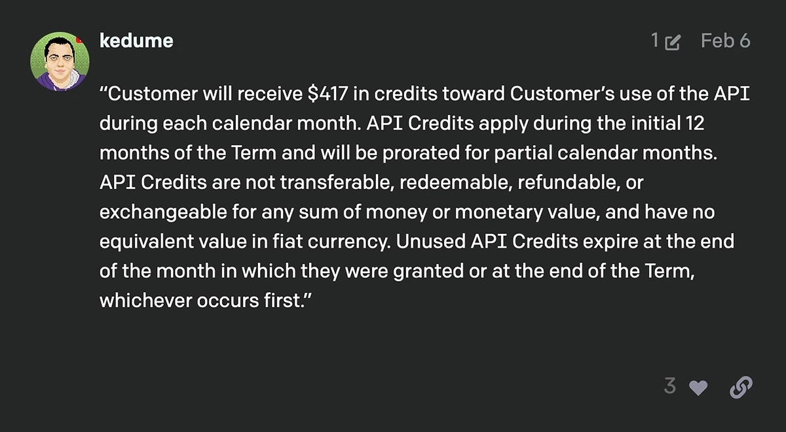

# ChatGPT Enterprise 定价、功能和局限性：值得为大型企业买单吗?

---

当 OpenAI 推出 ChatGPT Enterprise 时，他们称它为"迄今为止最强大的 ChatGPT 版本"。Canva、普华永道和 Klarna 这些大公司早早就入了坑。

但说实话,这玩意儿不便宜。作为一个专门面向大型企业的解决方案,它到底贵在哪?和其他版本的 ChatGPT 比起来,差别真的值那个价吗?

接下来我们聊聊 ChatGPT Enterprise 可能要花多少钱,它有什么功能和限制,以及这个工具未来可能怎么发展。

---

## ChatGPT Enterprise 多少钱?

ChatGPT Enterprise 是唯一一个不能自助购买的版本。也就是说,它没有固定价格。

你得联系 OpenAI 的销售团队谈价格(这在企业级 SaaS 世界里挺常见的)。

不过,还是有些线索能让我们猜到大概价位。

ChatGPT Enterprise 刚推出时,Reddit 论坛 r/ChatGPTPro 上有个用户说他联系过 OpenAI 销售团队。他拿到的报价是:

- 每用户每月 60 美元
- 最短合同期 12 个月
- 最少 150 个席位

OpenAI 没有公开确认这个 12 个月的最短期限是不是标准配置,也没说每用户每月 60 美元准不准确。

但如果这个报价是真的,我们可以算一下 ChatGPT Enterprise 的大致成本:

- **最低年费**: 150 个席位 × $60/月 × 12 个月 = $108,000
- **500 个席位年费**: 500 × $60 × 12 = $360,000
- **1000 个席位年费**: 1000 × $60 × 12 = $720,000

简单说,如果这个报价准确,ChatGPT Enterprise 的价格标签相当吓人。但这还是个大大的"如果"。

### ChatGPT Enterprise 的最低价格

作为参考,ChatGPT Enterprise 下面一档叫 ChatGPT Team。Team 版本按月付费是每用户每月 30 美元,按年付费是每用户每月 25 美元。

可以合理推测,Enterprise 不会比 Team 便宜,毕竟功能多得多。

所以,你基本不太可能以低于每用户每月 30 美元的价格拿到 ChatGPT Enterprise 许可证。

### ChatGPT Enterprise 定价与竞争对手对比

这个价格——每席位每月 30 美元——大致就是 OpenAI 竞争对手们为企业解决方案收的费。

比如微软的企业 AI 工具,目前定价是每用户每月 30 美元。不过,企业用户还需要有合格的 Microsoft 365 订阅。

Google 的 AI Gemini 可以添加到 Google Workspace。Gemini Enterprise 在年度或固定期限计划中的定价是每用户每月 30 美元。同样,也需要 Google Workspace 订阅。

今年 5 月,Anthropic 推出了其热门 AI 工具 Claude 的企业版本,叫 Claude Team。Claude Team 定价是每用户每月 30 美元。

简单说,截至 2024 年 6 月,企业 AI 工具的通行价似乎就是每用户每月 30 美元。

如果 ChatGPT Enterprise 真的定价 60 美元——或者接近这个数字——它会明显比任何竞争对手都贵。

更别提 OpenAI 相对更严格的最低用户要求了。

## ChatGPT Enterprise 的最低要求是什么?

ChatGPT Enterprise 目前只对至少 150 个用户的企业开放。

相比之下,Claude Team 的最低用户要求是 5 个。Microsoft Copilot 最初推出时最低要求 300 个用户,但后来取消了。Google Workspace Enterprise 也没有最低用户要求。

## ChatGPT Enterprise 功能

ChatGPT Enterprise 的定价和用户要求可能比竞争对手高一些,但你的钱到底换来了什么?

顾名思义,ChatGPT Enterprise 面向希望将 ChatGPT 整合到员工工作流程中的大型组织。

用 OpenAI 的话说,Enterprise 旨在为企业提供"一个能处理任何任务的工作 AI 助手,为你的组织定制,并保护你的公司数据。"

让我们拆解一下这些承诺。

### 无限制使用 ChatGPT-4

ChatGPT Enterprise 的第一个——也许也是最吸引人的——功能就是没有使用上限。

其他所有版本的 ChatGPT 都对用户与 ChatGPT 交互的频率有某种限制。在 ChatGPT Team 中,这个上限是每用户每 3 小时 100 条消息。ChatGPT Plus 每 3 小时给用户 40 次提示。

很多用户永远达不到这些限制。但是,如果你打算将 ChatGPT 完全整合到业务中,你可能会欣赏真正无限制地使用 OpenAI 强大的 GPT-4。

如果你担心在使用 ChatGPT 时会遇到限制,而且这会带来严重后果,那还是安全第一比较好。👉 [对于需要稳定高效 AI 工具的团队来说,不妨看看这个超值的 ChatGPT TEAM 会员方案,质保 30 天让你用得放心](https://shaoyumi.com/buy/65)

### 更快的 ChatGPT

根据 OpenAI 的说法,ChatGPT Enterprise 的运行速度比以前的 ChatGPT 版本快两倍。

用户可以无限访问 GPT-4 和 GPT-4o,截至 2024 年 6 月这是最先进的 ChatGPT 版本。

据 Asana 数据系统和集成主管说,ChatGPT Enterprise"平均每天减少了一小时的研究时间。"还不错!

### 更大的上下文窗口

ChatGPT Enterprise 发布时,OpenAI 宣传了它更大的上下文窗口,这实际上允许用户处理比以前大四倍的输入或文件。

不过自 8 月以来,更新版本的 ChatGPT 已经发布了更大的上下文窗口。比如 ChatGPT-4 和 GPT-4o 的上下文窗口有 128,000 个 token。

简单说,ChatGPT Enterprise 允许无限制使用拥有最大上下文窗口的 ChatGPT 版本。

OpenAI 把 128,000 token 的窗口描述为"一本中等到较长的小说"。但这到底意味着什么?

**什么是上下文窗口?**

上下文窗口是 ChatGPT 一次能"记住"的信息量。一旦超过这个限制,AI 可能会开始"忘记"对话的早期部分。所以更大的上下文窗口减少了这种情况发生的可能性。这让你可以和 ChatGPT 进行更长、更复杂的对话。它也允许 ChatGPT 处理更大、更详细的文件。

上下文窗口包括输入和输出。比如,一个更长的提示会占用上下文窗口。

但更大的上下文窗口不一定就更好。

**什么是 token?**

Token 是 ChatGPT 处理的单个信息片段。平均来说,在英文中一个 token 相当于 0.75 个单词。

如你所见,token 可以是一个完整的单词、单词的一部分、单个字母、标点符号等等。

那么 128,000 个 token 意味着你可以和 ChatGPT 进行大约 96,000 个单词的对话才会达到极限。正如 OpenAI 所说,这确实是平均小说长度偏长的一端。

理解 token 还有另一个原因很重要。使用 ChatGPT 的 API 时,你是按 token 收费的——更准确说,是按百万 token 收费。

### 免费 API token

幸运的是,ChatGPT Enterprise 为用户提供免费积分来使用 API。

OpenAI 在推出 ChatGPT Enterprise 时没有说明会提供多少积分。估计具体金额是要和 OpenAI 销售团队协商的,就像 ChatGPT Enterprise 本身的定价一样。

不过,OpenAI 论坛上有个用户报告了一个具体数字。他们引用了一个 OpenAI 客户收到的回复。这个客户每月获得 417 美元的积分。

那么,417 美元的积分能用多久?

**ChatGPT 的 API 要花多少钱?**

价格取决于你决定使用 ChatGPT 的哪个模型。记住,有了 ChatGPT Enterprise,你可以无限使用 GPT-4o,也可以使用不那么高级——但更便宜——的模型。

可以看出,417 美元可以用很久。当然,这只是一个报告的数字,你可能会拿到更低的报价。

不过要理解这些免费积分是否值得,你应该考虑一下你会用 ChatGPT API 做什么。

如果你想构建自己的 AI 聊天机器人,417 美元可能是过度配置。4 月份,AI 聊天机器人开发者 Mohamed Soufan 发布了一些估算,说明运行在 ChatGPT 上的 AI 聊天机器人可能花费不同企业多少钱。

他估计,一个每月帮助 100 个客户的客户服务 AI 聊天机器人每天只需 0.10 美元。

如果你觉得不会经常使用 API,免费积分的承诺可能不值得订阅 ChatGPT Enterprise 的额外价格。毕竟,你可以直接从 OpenAI 购买积分来使用 API。

但是,如果你要大量使用 API,那么免费积分很可能物有所值。此外,对于无论 API 使用情况如何都需要 ChatGPT Enterprise 的用户来说,它们是一个很棒的额外福利。

### 更高效的协作

ChatGPT Enterprise 的一大亮点是它简化了 ChatGPT 的协作使用方式。用户不必单独登录,ChatGPT Enterprise 为所有人提供单点登录。

管理员可以在中央仪表板上查看使用统计数据。这让你能评估你的业务如何使用 ChatGPT,以及它是否真的在帮助你。仪表板还允许你管理工作空间,提供各种团队管理控制功能。

此外,ChatGPT Enterprise 允许用户与同一组织中的其他用户共享聊天模板甚至自定义 GPT。虽然理论上可以通过传统消息服务共享模板,但能在 ChatGPT 内部直接这样做可以节省时间。

### 增强的安全性

ChatGPT Enterprise 的另一个好处是域验证。这个功能在发布自定义 GPT 时也包含在内,确保只有你能访问你的 ChatGPT 工具。

域验证还有助于确保组织内部的通信保持安全。

ChatGPT Enterprise 符合 SOC 2 标准,意味着它已经通过了审计。所有对话都是加密的,无论是在传输中还是静止时——不过这在 ChatGPT 的所有其他版本中也是如此。

OpenAI 在处理私人客户数据方面面临过重大的公众审查。这无疑是为什么该组织在宣布推出 ChatGPT Enterprise 时强调安全性的原因。

一方面,OpenAI 有一个专门的门户网站致力于确保和改进安全性和隐私。它受到摩根士丹利、Stripe、普华永道、Moderna 等主要组织的信任。

另一方面,OpenAI 的一些措辞透露的比公司可能想要的更多。

比如,Enterprise 隐私页面向读者保证"授权的 OpenAI 员工只会在解决事件、经你明确许可恢复最终用户对话或适用法律要求的情况下访问你的对话。"这都很好,但它确实表明对话是可以被员工访问的。这一点很重要,要记住。

### 改进的隐私

OpenAI 对 ChatGPT Enterprise 用户做出的一个重要承诺是保护他们的数据不被用于训练。

ChatGPT Free 和 Plus 的用户无法阻止 OpenAI 使用他们的数据来训练 ChatGPT。但是,来自 ChatGPT Team、API 和 Enterprise 的数据不用于训练。

理论上,这意味着你可以在使用 GPT 时包含潜在的敏感商业信息,而不用担心它会出现在公共版本的 ChatGPT 中。

ChatGPT Enterprise 用户还可以决定他们的数据保留多长时间。

### 整合公司数据

虽然 ChatGPT Enterprise 允许用户保持公司数据私密,但它也允许他们将其整合到 ChatGPT 中。用户可以使用他们的数据来训练自定义 GPT。

### 高级数据分析

ChatGPT Enterprise 用户可以无限访问高级数据分析,这以前叫代码解释器。

这个强大的工具允许用户上传复杂的文件——比如电子表格——并要求 ChatGPT 分析它们。这可能简单到问 AI,"这些数据有什么有趣的地方?"也可能包括数据可视化的请求。

## ChatGPT 自助计划 vs. Enterprise

### ChatGPT Enterprise 和 Plus 有什么区别?

ChatGPT Plus 面向想从 ChatGPT 中获得更多收益的单个用户。

有了 ChatGPT Plus,你可以提前体验新功能,使用 GPT-4o 发送更多消息,DALL-E 图像生成器的使用限制更少,以及与 ChatGPT Free 相比的其他好处。

它完全能胜任广泛的使用场景,包括 ChatGPT 用于 SEO。

但是,ChatGPT Plus 仍然有使用限制。它是为个人而非团队设计的,它的使用限制反映了这一点。

### ChatGPT Enterprise 和 Team 有什么区别?

ChatGPT Team 在 Enterprise 之后推出——在 2024 年 1 月——是 Plus 和 Enterprise 之间的中间地带。

Team 的最低用户要求只有 2 个。

它也是自助服务的,意味着你可以注册而无需联系 OpenAI 销售团队。价格是固定的,按月收费每用户每月 30 美元,按年收费每用户每月 25 美元。

虽然 ChatGPT Team 与 Enterprise 有许多相同的功能,但它不太强大。用户仍然有限制,无法决定数据保留多长时间。ChatGPT Enterprise 中包含的管理控制更全面,安全级别更高。

最后,也许最重要的是,在支持和账户管理方面,ChatGPT Enterprise 用户是 OpenAI 的首要任务。

### ChatGPT Enterprise 和 API 有什么区别?

虽然 ChatGPT Free、Plus、Team 和 Enterprise 都是同一产品的不同级别——即访问 ChatGPT——但 API 更像是一个面向开发者的接口。

开发者可以直接将 AI 集成到他们自己的应用程序或平台中,而不是使用 ChatGPT 应用程序与 AI 工具交互。然后他们的应用、平台或软件可以直接与 ChatGPT 交互。

用户不是按月(或年)收费,而是必须购买 token。ChatGPT Enterprise 是唯一包含 API 使用积分的 ChatGPT 级别。所有其他级别的 ChatGPT 用户必须单独购买 token。

## ChatGPT Enterprise 有多安全?

ChatGPT Enterprise 被 OpenAI 宣传为具有"企业级安全性"。它具有 ChatGPT 其他版本中包含的所有安全功能,包括所有对话的加密。

此外,ChatGPT Enterprise 符合 SOC 2 标准。Enterprise 数据不用于 ChatGPT 的训练,用户可以确定数据保留多长时间。最后,ChatGPT Enterprise 包括域验证和单点登录。

## 有多少人在使用 ChatGPT Enterprise?

根据 OpenAI 的说法,他们目前有大约 260 个 Enterprise 客户。

但是,值得注意的是,这些 Enterprise 账户总共有 150,000 个席位。这是一个相当可观的数字。

---

## 结语

ChatGPT Enterprise 仍然是 OpenAI 最全面的产品。它旨在满足大型组织的需求,价格标签很可能会反映这一点。

这个价格包括其他任何 ChatGPT 版本都没有的许多功能,包括增强的安全性、全面的管理控制和慷慨的 API 积分。不过说实话,对于真正需要高度安全、无限使用和企业级支持的大型团队来说,这些功能确实物有所值。如果你的团队规模不到 150 人但又需要稳定可靠的 AI 协作工具,👉 [不妨考虑这个性价比更高的 ChatGPT TEAM 会员方案,30 天质保让你无后顾之忧](https://shaoyumi.com/buy/65)

但是,其他版本——包括同样面向组织的 ChatGPT Team——有自助服务的好处,价格公开透明。
